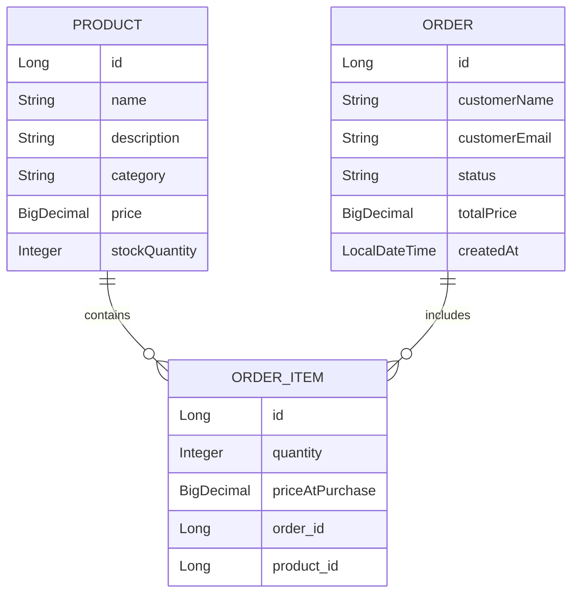

# 🛒 Product Catalog REST API

A simple **E-commerce-inspired REST API** built using **Java Spring Boot**, allowing users to manage **products, orders, and order items** with core CRUD functionalities.

This project demonstrates how to build a backend REST API using **Spring Boot**, **JPA/Hibernate**, and **PostgreSQL (Supabase)** while maintaining proper entity relationships similar to a minimal e-commerce ordering system.

---

## 🚀 Features

- ✅ Product CRUD operations
- ✅ Order management system
- ✅ Order item handling
- ✅ Entity relationships using JPA/Hibernate
- ✅ PostgreSQL database integration via Supabase
- ✅ Request validation
- ✅ OpenAPI/Swagger documentation
- ✅ Environment variable support with Dotenv
- ✅ Lombok integration for cleaner code

---

## 🏗️ System Architecture

```text
Client (Frontend / Postman)
            │
            ▼
Spring Boot REST API
            │
            ▼
JPA / Hibernate ORM
            │
            ▼
Supabase PostgreSQL Database
```

---

## 📌 Tech Stack

| Technology | Purpose |
|------------|---------|
| Java 25 | Programming Language |
| Spring Boot 4 | Backend Framework |
| Spring Web MVC | REST API Development |
| Spring Data JPA | ORM & Database Access |
| Hibernate | JPA Implementation |
| PostgreSQL | Relational Database |
| Supabase | Cloud PostgreSQL Provider |
| Lombok | Boilerplate Reduction |
| Maven | Dependency Management |
| Swagger / OpenAPI | API Documentation |
| Dotenv | Environment Variables |
| Spring DevTools | Development Productivity |

---

## 📂 Project Structure

```bash
src
├── main
│   ├── java
│   │   └── com.ruzny.product_catalog
│   │       ├── controllers
│   │       ├── services
│   │       ├── repositories
│   │       ├── entities
│   │       └── config
│   │
│   └── resources
│       ├── application.properties
│       └── .env
│
└── test
```

---

## 🧩 Entity Relationship Diagram (ERD)



---

## 🔗 Entity Relationships

This project follows a **real-world e-commerce relationship structure**.

### 1. Product → OrderItem (One-to-Many)

One product can belong to multiple order items.

```java
@OneToMany(mappedBy = "product")
private List<OrderItem> orderItems;
```

Example:

- Product: **iPhone**
- Can appear in:
  - Order #101
  - Order #102
  - Order #103

---

### 2. Order → OrderItem (One-to-Many)

One order can contain multiple order items.

```java
@OneToMany(mappedBy = "order")
private List<OrderItem> orderItems;
```

Example:

Order #1001:

- 2 × Laptop
- 1 × Mouse
- 3 × Keyboard

---

### 3. OrderItem → Product & Order (Many-to-One)

An order item acts as a **bridge entity** between products and orders.

```java
@ManyToOne
@JoinColumn(name = "product_id")
private Product product;

@ManyToOne
@JoinColumn(name = "order_id")
private Order order;
```

This creates a **Many-to-Many relationship** between:

```text
Products <----> Orders
```

through:

```text
OrderItems
```

---

## 🗄️ Database Schema

### Products Table

| Column | Type |
|--------|------|
| id | BIGINT |
| name | VARCHAR |
| description | TEXT |
| category | VARCHAR |
| price | DECIMAL |
| stock_quantity | INTEGER |

### Orders Table

| Column | Type |
|--------|------|
| id | BIGINT |
| customer_name | VARCHAR |
| customer_email | VARCHAR |
| status | VARCHAR |
| total_price | DECIMAL |
| created_at | TIMESTAMP |

### Order Items Table

| Column | Type |
|--------|------|
| id | BIGINT |
| quantity | INTEGER |
| price_at_purchase | DECIMAL |
| order_id | BIGINT |
| product_id | BIGINT |

---

## ⚙️ Installation & Setup

### 1. Clone the Repository

```bash
git clone https://github.com/your-username/product-catalog.git

cd product-catalog
```

---

### 2. Configure Environment Variables

Create a `.env` file inside the root directory:

```env
DB_URL=your_database_url
DB_USERNAME=your_username
DB_PASSWORD=your_password
```

---

### 3. Configure `application.properties`

```properties
spring.datasource.url=${DB_URL}
spring.datasource.username=${DB_USERNAME}
spring.datasource.password=${DB_PASSWORD}

spring.jpa.hibernate.ddl-auto=update
spring.jpa.show-sql=true
spring.jpa.properties.hibernate.format_sql=true
```

---

### 4. Install Dependencies

```bash
mvn clean install
```

---

### 5. Run the Application

```bash
mvn spring-boot:run
```

The server will start on:

```bash
http://localhost:8080
```

---

## 📘 API Documentation (Swagger UI)

This project includes **Swagger/OpenAPI** support for testing APIs visually.

After starting the application, visit:

```bash
http://localhost:8080/swagger-ui.html
```

or

```bash
http://localhost:8080/swagger-ui/index.html
```

---

## 🔌 Example API Endpoints

### Product APIs

| Method | Endpoint | Description |
|--------|----------|-------------|
| GET | `/api/products` | Get all products |
| GET | `/api/products/{id}` | Get product by ID |
| POST | `/api/products` | Create new product |
| PUT | `/api/products/{id}` | Update product |
| DELETE | `/api/products/{id}` | Delete product |

---

### Order APIs

| Method | Endpoint | Description |
|--------|----------|-------------|
| GET | `/api/orders` | Get all orders |
| GET | `/api/orders/{id}` | Get order by ID |
| POST | `/api/orders` | Create new order |
| DELETE | `/api/orders/{id}` | Delete order |

---

### Order Item APIs

| Method | Endpoint | Description |
|--------|----------|-------------|
| GET | `/api/order-items` | Get all order items |
| POST | `/api/order-items` | Create order item |

---

## 🧪 Validation Rules

### Product Validation

- Product name cannot be blank
- Price must be greater than zero
- Stock quantity cannot be negative

### Order Validation

- Customer name cannot be blank
- Customer email cannot be blank
- Total price must be greater than zero

---

## 📦 Dependencies Used

### Core Spring Dependencies

```xml
spring-boot-starter-webmvc
spring-boot-starter-data-jpa
```

### Database

```xml
postgresql
```

### Documentation

```xml
springdoc-openapi-starter-webmvc-ui
```

### Utilities

```xml
lombok
dotenv-java
spring-boot-devtools
```

---

## 📖 Useful Documentation

- Spring Boot Docs  
  https://spring.io/projects/spring-boot

- Spring Data JPA  
  https://spring.io/projects/spring-data-jpa

- Hibernate ORM  
  https://hibernate.org/orm/

- PostgreSQL Docs  
  https://www.postgresql.org/docs/

- Supabase Docs  
  https://supabase.com/docs

- Swagger/OpenAPI  
  https://swagger.io/

---

## 🔮 Future Improvements

- Authentication & Authorization (JWT)
- User management
- Pagination & filtering
- Order status workflow
- Docker support
- Unit & integration testing
- CI/CD pipeline

---

## 👨‍💻 Author

**Ruzny**  
Modern AI-Native Full Stack Engineer

If you found this project useful, consider giving it a ⭐ on GitHub.

---